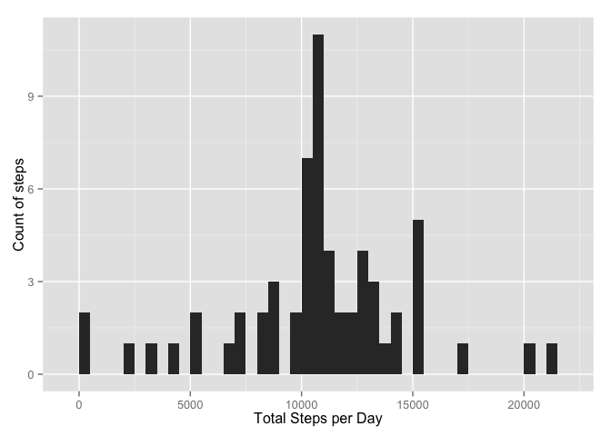

# Reproducible Research: Peer Assessment 1

```r
library(knitr)
library(ggplot2)

options("scipen"=5)
opts_chunk$set(echo = TRUE)
```

## Loading and preprocessing the data
1. Load the data
a) Unzip "activity.zip", if needed, and read the extracted csv file. As specified columns are steps:numeric, date:Date and interval:numeric.
b) Check loaded data


```r
if(!file.exists('activity.csv')){
  unzip('activity.zip')
}

activitydata <- read.csv('activity.csv', colClasses=c("numeric", "Date", "numeric"))  
head(activitydata)
```

```
##   steps       date interval
## 1    NA 2012-10-01        0
## 2    NA 2012-10-01        5
## 3    NA 2012-10-01       10
## 4    NA 2012-10-01       15
## 5    NA 2012-10-01       20
## 6    NA 2012-10-01       25
```

2. Process/transform the data (if necessary) into a format suitable for your analysis


```r
# already processed columns into respective data-classes while loading
```

## What is mean total number of steps taken per day?
1. Make a histogram of the total number of steps taken each day


```r
dailysteps <- tapply(activitydata$steps, activitydata$date, sum, na.rm=T)

# making plot using qplot from ggplot2 package which is a better looking histogram than the one histo from base creates
qplot(dailysteps, xlab='Total Steps per Day', ylab='Count of steps', binwidth=500)
```

 

2. Calculate and report the mean and median total number of steps taken per day


```r
meanofdailysteps <- mean(dailysteps, na.rm=T)
  
medianofdailysteps <- median(dailysteps, na.rm=T)
```

For total number of steps taken per day  
mean is **9354.2295082** and  
median is **10395**  

## What is the average daily activity pattern?
1. Make a time series plot (i.e. type = "l") of the 5-minute interval (x-axis) and the average number of steps taken, averaged across all days (y-axis)


```r
averagesteps_per_interval <- aggregate(x=list(steps=activitydata$steps), by=list(interval=activitydata$interval), FUN=mean, na.rm=T)  
  
ggplot(averagesteps_per_interval, aes(x=interval, y=steps)) + xlab("5-Minute Interval") + ylab("Average Steps") + geom_line()  
```

 

2. Which 5-minute interval, on average across all the days in the dataset, contains the maximum number of steps?


```r
maxin5min <- averagesteps_per_interval[which.max(averagesteps_per_interval$steps), ]
maxin5min
```

```
##     interval    steps
## 104      835 206.1698
```

Interval (835) contains maximum number of steps (206).  

## Imputing missing values
1. Calculate and report the total number of missing values in the dataset (i.e. the total number of rows with NAs)  


```r
countna <- length(which(is.na(activitydata$steps)))  
```

Count of missing values : 2304

2. Devise a strategy for filling in all of the missing values in the dataset. The strategy does not need to be sophisticated. For example, you could use the mean/median for that day, or the mean for that 5-minute interval, etc.  

**Strategy picked** : each missing value to be replaced by the mean for that 5-minute interval

3. Create a new dataset that is equal to the original dataset but with the missing data filled in.  


```r
# define a function find what would be new value for that 5-minute interval
nareplacer <- function(steps, interval) {  
  if(!is.na(steps))
    newvalue <- c(steps)
  else
    newvalue <- (averagesteps_per_interval[averagesteps_per_interval$interval == interval, 'steps'])
  return (newvalue)
}

modified_activitydata <- activitydata
modified_activitydata$steps <- mapply(nareplacer, modified_activitydata$steps, modified_activitydata$interval)
```

4. Make a histogram of the total number of steps taken each day and Calculate and report the mean and median total number of steps taken per day. Do these values differ from the estimates from the first part of the assignment? What is the impact of imputing missing data on the estimates of the total daily number of steps?


```r
modified_dailysteps <- tapply(modified_activitydata$steps, modified_activitydata$date, sum, na.rm=T)

# making plot using qplot from ggplot2 package which is a better looking histogram than the one histo from base creates
qplot(modified_dailysteps, xlab='Total Steps per Day', ylab='Count of steps', binwidth=500)
```

 

```r
modified_meanofdailysteps <- mean(modified_dailysteps)
modified_medianofdailysteps <- median(modified_dailysteps)

mean_diff = modified_meanofdailysteps - meanofdailysteps  
median_diff = modified_medianofdailysteps - medianofdailysteps
```

Compared to unadulterated data set,  
the value of mean **increased by 1412** to 10766 and  
the value of median **increased by 371** to 10766   

In the unadulterated data, there are some intervals with steps values NA for a day. The total number of steps taken in such intervals are set to 0 by default. However, after replacing missing values for steps with the mean steps of associated interval value, these 0s are replaced with a positive or higher integer value.  

## Are there differences in activity patterns between weekdays and weekends?
1. Create a new factor variable in the dataset with two levels – “weekday” and “weekend” indicating whether a given date is a weekday or weekend day.


```r
weekend_weekday <- function(date) {  
  day <- weekdays(date)
  if (day %in% c('Saturday', 'Sunday'))
    return ("weekend")
  else
    return ("weekday")
}

modified_activitydata$day <- sapply(modified_activitydata$date, FUN=weekend_weekday)
```

2. Make a panel plot containing a time series plot (i.e. type = "l") of the 5-minute interval (x-axis) and the average number of steps taken, averaged across all weekday days or weekend days (y-axis).  


```r
modified_averagesteps_per_interval <- aggregate(steps ~ interval + day, data = modified_activitydata, mean)  

# making plot using ggplot from ggplot2 package which is a better looking histogram than the one histo from base creates
ggplot(modified_averagesteps_per_interval, aes(interval, steps)) + geom_line() + facet_grid(day ~ .) + xlab("5-Minute Interval") + ylab("Average Steps")  
```

 
